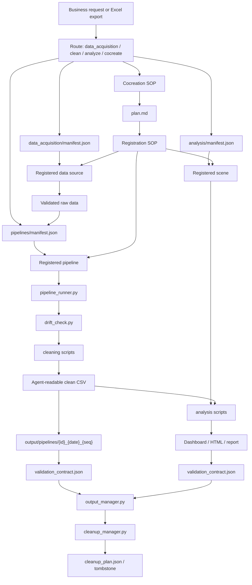

# Xier Business Excel Workflow Skill

中文名：Xier 业务 Excel 工作流 Skill

Xier Business Excel Workflow Skill 是一个面向业务、运营、电商、市场和销售分析场景的 Excel / CSV 数据工作流 Skill，用来帮助用户把日常从各类系统里取得或下载的表格数据，转成 Agent 更容易理解、校验和复用的数据资产。

它适合处理这类真实工作流：从天猫生意参谋、数据银行、广告后台、CRM、ERP、订单系统、会员系统、线下门店系统或公司内部 BI 下载 Excel，然后需要清洗、合并、规整、分析，最后形成业务复盘、经营看板、对外协同表格、HTML 报告或下一步行动建议。

很多 SaaS 和平台导出的 Excel，本质上是给人看的：合并表头、多层标题、宽表、汇总行、说明行、空白行、百分比文本、千分位、备注 Sheet、隐藏结构、口径写在角落里。人能看懂，Agent 和 AI 却很容易误读。这个 Skill 的核心任务，就是先把这些“人可视”的 Excel 变成“Agent 可理解”的规整 CSV，再基于 CSV 产出业务和运营日常真正需要的分析结果、图表和报告。

换句话说，它不是一个通用 Excel 工具，也不是一个只会总结表格的提示词。它更像一个业务数据工作台的底层工作流：第一次遇到某类数据源、某类表或某类分析时，与用户共创数据获取路径、清洗规则和分析口径；跑通后注册成可复用 data_acquisition source、pipeline 或 analysis scene；之后同类任务可以稳定复用，并用 source contract / validation contract 证明结果边界。

## 为什么需要

- **业务系统导出的 Excel 通常不是 AI 友好的数据表**  
  运营和业务同学每天拿到的报表，往往是为了人工浏览而设计，不是为了机器读取。合并单元格、说明行、跨列表头、汇总行、宽表日期列、单位混写、`-`、`N/A`、百分比文本都会让 Agent 容易读错。

- **日常运营分析不是“上传表格，让 AI 看一眼”就够了**  
  比如看天猫生意参谋的销售、流量、转化、商品、渠道或人群数据，用户真正需要的是：哪些指标变了、为什么变、哪个渠道或商品拖累、哪个区域或人群有机会、下周该看什么动作，而不是一段泛泛摘要。

- **同一类报表会反复出现，不能每次从零解释**  
  业务/运营工作里常见的是日报、周报、月报、活动复盘、渠道监控、商品表现、人群分析、销售追踪。第一次可以共创规则，但第二次应该能复用同一套清洗和分析动线。

- **AI 输出必须能被核验，不能只靠看起来合理**  
  销售额、转化率、同比、占比、ROI、客单价、GMV、订单数、库存、达成率这类数字一旦错了，会影响经营判断。这个 Skill 要求生成结果后必须由独立 validation contract 判定状态。

- **业务协同需要可交付产物，而不只是聊天结论**  
  用户经常需要把结果发给老板、同事、供应商、代理商或跨部门团队。因此输出不只是一段分析，还可能是规整 CSV、Excel Dashboard、HTML 报告、图表、校验报告和可复跑的脚本记录。

- **历史数据和每日新增数据需要受控管理**  
  同一张表每天新增一天数据时，默认完整重跑生成新 run；旧 CSV 不直接 append，不手工改，而是通过 cleanup plan 和 tombstone 受控清理，避免误删或污染历史分析。

## 功能

- 处理业务和运营场景中的 Excel / CSV 报表，包括平台后台、公司系统、SaaS 工具和内部 BI 导出数据
- 当用户没有上传文件时，先通过 data_acquisition source 沉淀合法、可复现、可验证的数据获取路径
- 将适合人看的 Excel 清洗成适合 Agent 和 AI 理解的规整 CSV，优先保留 source sheet、source row、source cell / range 等溯源信息
- 支持宽转长、合并表头拆解、说明行 / 汇总行排除、日期标准化、百分比 / 千分位 / 货币 / 空值统一等清洗规则
- 支持基于清洗 CSV 做业务分析，例如销售趋势、渠道表现、商品表现、人群转化、区域对比、活动复盘、异常识别、机会点提取
- 支持生成业务或运营协同所需的多形态产物：clean CSV、Excel Dashboard、HTML 报告、Markdown 分析、关键数校验报告
- 首次遇到新数据源、新类型报表或新分析场景时走共创流程，用 `plan.md` 对齐用户意图、数据来源、字段含义、指标口径、输出形态和验收标准
- 将跑通的数据获取路径注册到 `data_acquisition/`，将跑通的清洗动线注册到 `pipelines/`，将跑通的分析场景注册到 `analysis/scenes/`，后续一句话复用
- 用 validation contract 控制交付状态，明确区分 `generated`、`verified`、`partial_verified`、`validation_failed`
- 用 `pipeline_runner.py` 串联已注册清洗动线的匹配、preflight、drift check、生成、校验和 usage 更新
- 用 `cleanup_manager.py` 对同 pipeline 的旧 run 生成 cleanup plan，并在用户确认或显式策略允许后只删除计划内旧 CSV
- 用 `consistency_check.py` 检查注册套件的文件、yaml、脚本、依赖、manifest 和校验隔离
- 将业务专属经验留在具体 pipeline / scene 的 `LEARNINGS.md`，将通用规则缺口登记到 `docs/IMPROVEMENTS.md`

不支持把平台私有 API、登录态、cookie、验证码、付费墙或反爬工作流内置进 Skill。本 Skill 可以记录用户已有权限下的数据获取 pipeline，但 SQL 编写、API connector、浏览器自动化、OAuth、secret management 都交给用户环境里的专业 Skill、MCP、官方插件、企业批准能力或外部工作台。它也不内置任何行业指标模板；具体口径由用户和 Agent 在共创时确认，并沉淀到对应套件。

如果后续接入专门的 HTML 分析 Skill，本 Skill 更适合作为上游数据与证据层：提供 clean CSV、CALIBERS、数据范围、关键数锚点和 validation summary；HTML 分析 Skill 可在此基础上负责报告叙事、版式、可视化体验和行动建议表达。

## 适用场景

- 电商运营：天猫生意参谋、数据银行、万相台、京东商智、抖店、快手小店等平台导出报表的清洗与分析
- 品牌经营：销售、流量、转化、商品、渠道、人群、会员、活动数据的日常监控和复盘
- 销售管理：区域、门店、客户、渠道、产品线、目标达成和同比环比分析
- 市场投放：广告花费、转化、ROI、线索、触点、活动表现和预算复盘
- 内部运营：从 ERP、CRM、订单系统、库存系统、客服系统、BI 平台导出的 Excel 报表处理
- 对外协同：给供应商、代理商、服务商、跨部门团队提供清洗后的 CSV、Dashboard、HTML 报告或关键数说明

不适合的场景：

- 要求本 Skill 直接连接平台 API 或爬取平台数据
- 处理没有授权的第三方数据
- 只需要一次性人工改表、没有复用价值的极小任务
- 缺少任何源数据，只要求模型凭空给经营结论

## Agent 兼容

这是一个通用 Agent Skill。核心入口是根目录的 `SKILL.md`，同一份源包可以用于不同 agent：

| Agent | 安装路径 |
|---|---|
| Codex | `~/.codex/skills/xier-business-excel-workflow-skill/` 或 `.codex/skills/xier-business-excel-workflow-skill/` |
| Claude Code | `~/.claude/skills/xier-business-excel-workflow-skill/` 或 `.claude/skills/xier-business-excel-workflow-skill/` |
| Kimi Code | `~/.kimi/skills/xier-business-excel-workflow-skill/`、`.kimi/skills/xier-business-excel-workflow-skill/`，或 `kimi --skills-dir /path/to/skills` |

建议维护一份 Skill 源包，不要为不同 agent 分叉出多份 `SKILL.md`。

## 文字规范

- 面向用户的说明文字使用中文。
- 文件名、命令、JSON key、yaml key、状态值、Agent 名称保留英文。
- `SKILL.md` 的 frontmatter `name` 使用 lowercase hyphen-case：`xier-business-excel-workflow-skill`。
- 业务字段和口径命名由具体 pipeline / scene 决定，不写入 Skill 本体。
- 交付时必须按 validation contract 表达验证状态、验证范围、未验证范围、oracle 来源、假设项和关键数复算。

## 目录结构

```text
.
├── SKILL.md                    # Agent Skill 入口：路由、硬规则、按需读取导航
├── docs/                       # SOP、环境检查、Excel 原则、验收、验证契约、自迭代登记
├── tools/                      # runner、cleanup、output state、drift、consistency、recalc 等确定性工具
├── data_acquisition/           # 数据获取 source 注册中心；manifest 初始为空
├── pipelines/                  # 清洗动线注册中心；manifest 初始为空
├── analysis/                   # 分析场景注册中心；manifest 初始为空
└── references/                 # 数据字典等轻量共享参考
```

关键文件：

| 文件 | 用途 |
|---|---|
| `SKILL.md` | Skill 触发入口、四种模式、路由表、硬规则和按需读取导航 |
| `docs/DATA_ACQUISITION_SOP.md` | 数据获取模式：source 匹配、source_preflight、引用文件读取、raw data 校验和 handoff |
| `docs/COCREATION_SOP.md` | 首次共创流程：先建 `plan.md`，再生成脚本和校验闭环 |
| `docs/REGISTRATION_SOP.md` | 把已跑通的 workspace 产物规范化迁入 Skill 的注册 checklist |
| `docs/EXECUTION_SOP.md` | 已注册清洗动线、分析场景和跨动线分析的执行流程 |
| `docs/ENVIRONMENT_READINESS.md` | 收窄的安装 / 首次运行 gate：workbench_profile + table_processing_need + derived outputs |
| `docs/EXCEL_AGENT_PRINCIPLES.md` | Agent 处理 Excel / CSV 的通用原则 |
| `docs/OUTPUT_ACCEPTANCE.md` | CSV、Excel Dashboard、HTML 报告和旧 run cleanup 的验收标准 |
| `docs/VALIDATION_CONTRACT.md` | 机器可读验证状态契约 |
| `docs/VALIDATION_PATTERNS.md` | 独立校验脚本、关键数锚点、Dashboard / HTML 替代验收模式 |
| `docs/IMPROVEMENTS.md` | 注册复盘阶段登记通用规则缺口和工具化机会 |
| `tools/pipeline_runner.py` | 已注册清洗动线的标准 runner |
| `tools/cleanup_manager.py` | 同 pipeline 旧 run 的 cleanup plan / apply / tombstone 工具 |
| `tools/output_manager.py` | 输出目录、run 状态、validation 摘要和 usage 管理 |
| `tools/drift_check.py` | 已注册 pipeline 的结构漂移检查 |
| `tools/consistency_check.py` | 注册质检和 manifest 汇编 |
| `data_acquisition/sources/_template/` | 新数据获取 source 脚手架 |
| `pipelines/_template/` | 新清洗动线脚手架 |
| `analysis/scenes/_template/` | 新分析场景脚手架 |

## 安装

```bash
cd xier-business-excel-workflow-skill
python3 tools/consistency_check.py --skill-root .
```

如果环境中还没有 `PyYAML` / `openpyxl`，注册、runner 和基础 xlsx 处理相关能力需要先安装：

```bash
python3 -m pip install -r requirements.txt
```

安装后或首次处理表格数据前，先按 `docs/ENVIRONMENT_READINESS.md` 做轻量 gate：

```text
workbench_profile
table_processing_need
detected_table_backend
recommendation
risk_notes.visual_acceptance_need
```

SQL / API / browser download / external workbench / secret management 不进入 readiness gate，只在 data_acquisition source_preflight 中表达缺口。缺 Excel / xlsx 文件处理能力时，Workbuddy / 外部 Agent / 企业 Agent 默认建议 `xlsx.skill`；Codex / OpenAI runtime 默认使用 `spreadsheets` skill。

## 配置

Xier Business Excel Workflow 初始不预置任何业务 data_acquisition source、pipeline 或 analysis scene。生产使用前，通常先完成一次共创并注册。

1. 新数据获取 source 配置：

```text
data_acquisition/sources/{source_id}/acquisition.yaml
data_acquisition/sources/{source_id}/plan.md
data_acquisition/sources/{source_id}/ACCESS.md
data_acquisition/sources/{source_id}/RUNBOOK.md 或 PROMPT.md 或 SUBAGENT_TASK.md
data_acquisition/sources/{source_id}/LEARNINGS.md
data_acquisition/sources/{source_id}/scripts/（可选）
```

2. 新清洗动线配置：

```text
pipelines/{pipeline_id}/pipeline.yaml
pipelines/{pipeline_id}/plan.md
pipelines/{pipeline_id}/CALIBERS.md
pipelines/{pipeline_id}/LEARNINGS.md
pipelines/{pipeline_id}/scripts/
```

3. 新分析场景配置：

```text
analysis/scenes/{scene_id}/scene.yaml
analysis/scenes/{scene_id}/plan.md
analysis/scenes/{scene_id}/CALIBERS.md
analysis/scenes/{scene_id}/LEARNINGS.md
analysis/scenes/{scene_id}/scripts/
```

4. 清洗动线 lifecycle 配置示例：

```yaml
run_lifecycle:
  cleanup_policy: ask
  keep_latest: 1
  keep_days: 14
  delete_scope: csv_only
  protect:
    pinned: true
    referenced_by_analysis: true
    validation_reports: true
    info_files: true
  tombstone: cleanup_tombstone.json
```

`cleanup_policy` 可选：

```text
disabled
ask
auto_delete_csv
```

默认建议使用 `ask`。只有用户明确允许或具体 pipeline 已确认策略时，才使用 `auto_delete_csv`。

## 运行链路

稳定表格工作流使用 Step 0-7：

```text
Step 0  路由：判断数据获取 / 清洗 / 分析 / 共创
Step 1  数据获取：没有 raw data 时匹配或共创 data_acquisition source
Step 2  共创或匹配：读取 manifest，确认 source / pipeline / scene
Step 3  preflight：source_preflight、轻量 readiness、依赖、输入结构、drift 检查
Step 4  生成：运行清洗或分析脚本，写入 output run
Step 5  validation：独立校验脚本输出 validation contract
Step 6  状态写回：output_manager 写 run status / usage
Step 7  交付：按 contract 说明证据、边界和 cleanup 状态
```

Skill Graph：



首次配置和调优会使用额外步骤：

```text
Step -1  环境 readiness 检查
Step -2  plan.md 口径共创
Step 7   注册复盘
Step 8   是否把经验写入 IMPROVEMENTS / template 候选
```

稳定模式下，不重复执行共创和注册，除非用户要求新增动线、修改口径、处理结构漂移或升级套件。

## 手动命令

列出已启用清洗动线：

```bash
python3 tools/pipeline_runner.py list --skill-root .
```

匹配某个输入文件：

```bash
python3 tools/pipeline_runner.py match \
  --skill-root . \
  --input /path/to/source.xlsx
```

运行已注册清洗动线：

```bash
python3 tools/pipeline_runner.py run \
  --skill-root . \
  --input /path/to/source.xlsx \
  --output-root /path/to/workspace/output \
  --yes-first-run
```

手动生成旧 run cleanup 计划：

```bash
python3 tools/cleanup_manager.py plan \
  --output-root /path/to/workspace/output \
  --kind pipelines \
  --suite-id your_pipeline_id \
  --latest-run /path/to/workspace/output/pipelines/your_pipeline_id_20260705_001
```

确认后执行 cleanup：

```bash
python3 tools/cleanup_manager.py apply \
  --plan /path/to/cleanup_plan.json \
  --confirm
```

注册质检：

```bash
python3 tools/consistency_check.py --skill-root .
```

汇编 manifest：

```bash
python3 tools/consistency_check.py --skill-root . --write-manifest
```

## 测试

发布包内的最小检查：

```bash
python3 tools/consistency_check.py --skill-root .
```

脚本语法检查（会生成 `__pycache__`，发布前需清理）：

```bash
python3 -m py_compile tools/*.py
```

如果是在完整开发仓库中，还可以从仓库根目录执行回归：

```bash
python3 work/doc_coherence_tests/scripts/test_output_manager_state.py
python3 work/doc_coherence_tests/scripts/test_cleanup_manager.py
python3 work/env_readiness_registration_tests/test_docs_contract.py
```

开源包发布前应确认不包含 Python bytecode：

```bash
find . -type f \( -name '*.pyc' -o -path '*/__pycache__/*' \) -print
```

## 输出和缓存

清洗输出：

```text
output/pipelines/{pipeline_id}_{YYYYMMDD}_{seq}/
```

分析输出：

```text
output/analysis/{scene_id}_{YYYYMMDD}_{seq}/
```

典型 run 目录包含：

```text
info.json
pipeline_info.yaml 或 analysis_info.yaml
validation_contract.json
validation_report.md
生成产物 CSV / XLSX / HTML
cleanup_plan.json（如存在旧 run）
cleanup_tombstone.json（旧 run 被清理后写入旧 run 目录）
```

旧 run 清理原则：

- 新 run 未通过 validation 时，不清理旧 run。
- 默认只生成 cleanup plan，不自动删除。
- `auto_delete_csv` 只能删除旧 run 中 plan 列出的 CSV。
- `info.json`、validation contract、validation report 和 tombstone 应保留。
- 被 analysis run 引用或 pinned 的旧 run 默认保护。

## 许可证

本项目使用 GNU Affero General Public License v3.0（AGPL-3.0-only）。详见 `LICENSE`。
