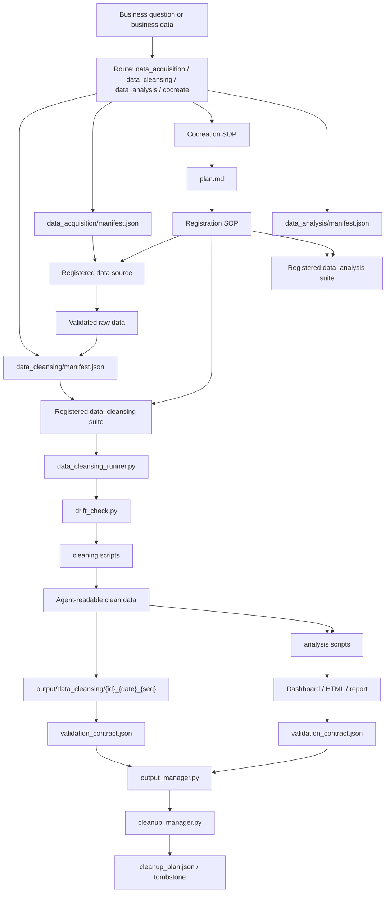

# Xier Business Data Workflow Skill

中文名：业务数据工作流Skill

让 Agent 稳定复用同类业务数据的获取、处理和分析流程，用可校验的数据资产支持业务问题回答和决策输出。

这个 Skill 面向业务、运营、电商、市场、销售分析和企业内部 Agent 场景。它帮助 Agent 在用户已有权限下取得或接收业务数据，清洗成可理解、可追溯、可校验的数据资产，再基于这些数据生成业务分析、看板、报告或协同产物，让数据更高效地支持业务决策，回答业务问题。

它支持的常见 raw data 形态包括 Excel、CSV、JSON、JSONL、网页表格、BI 导出文件、业务系统下载文件和压缩包。第一次遇到某类数据源、新表结构或新分析问题时，与 Agent 共创数据获取路径、清洗规则、分析口径和验收标准；跑通后注册成可复用的 `data_acquisition` source、`data_cleansing` suite 或 `data_analysis` suite；之后同类任务可以稳定复用，并用 source contract / validation contract 说明结果边界。

它不是通用 Excel 编辑器，也不是爬虫、SQL 客户端、API connector 或 secret manager。它是给 Agent 使用的业务数据工作流护栏：负责路由、共创、注册、复用、溯源、校验和交付边界。

## 这个 Skill 适合谁

- 业务、运营、电商、市场、销售分析人员：需要反复处理同类业务数据，让数据更稳定地支持业务决策、业务复盘、经营看板和问题分析。
- 企业内部 Skill / Agent 构建者：需要把企业内部反复出现的数据获取、清洗、分析和交付流程沉淀成可迁移、可审计、可复跑的 Agent 能力。

## 它解决什么问题

- 业务数据来源和格式多，不一定是 Excel，也可能是 CSV、JSON、JSONL、网页表格、BI 导出文件、业务系统下载包或外部工作台产物。
- 平台、BI、SaaS 和业务系统导出的表和文件，经常是给人看的，不是给 Agent 稳定读取和计算的。
- 同类数据获取、清洗和分析场景会反复出现，不应该每次都从零解释字段、口径、数据范围和输出标准。
- 业务决策需要的数据必须准确，字段、口径、来源、处理过程和关键数都要能追溯和复核。
- 多类业务问题分析场景需要组合复用，而不是堆一批一次性 Skill、脚本或 prompt。
- 当分析场景越来越多时，需要统一的 source / suite / manifest / contract 结构，让 Agent 能稳定完成触发、选择和组合调用。
- AI 产出的分析和决策支持结论必须可校验，不能只看起来合理。

## 你会得到什么

- 同类业务数据再次出现时，Agent 可以复用已注册的 source / suite 取得或接收数据、清洗数据、复用口径，并回答对应业务问题。
- 业务分析、看板、报告或协同产物会带上数据范围、关键数、口径、假设和验证状态，不只是一段无法复核的分析文字。
- 关键结论可以说明数据从哪里来、经过了什么处理、哪些范围已验证、哪些范围不能声明，降低“AI 看起来合理但数字不可信”的风险。
- 新数据源、新表结构或新分析问题可以通过共创沉淀为可复用的 `data_acquisition` source、`data_cleansing` suite 或 `data_analysis` suite。
- 越来越多的业务分析场景可以收敛到可路由、可选择、可组合、可维护的结构里，方便 Agent 后续稳定调用。
- 企业内部团队可以复用这套骨架和契约模板，沉淀 source、suite、manifest、CALIBERS、LEARNINGS、source contract、validation contract 和运行记录。

## 它不是什么

- 不是完整 Excel 引擎。
- 不是 SQL Skill。
- 不是 API connector。
- 不是浏览器自动化 Skill。
- 不是 secret manager。
- 不是固定行业指标模板。
- 不是一次性人工改表工具。

SQL、API、browser download、external workbench、secret management 依赖用户自身环境的授权、账号、企业安全策略和已安装的专业数据获取 Skill / connector。本 Skill 只记录和复用这些已获授权的数据获取路径，不替用户推荐、内置或绕过这些能力。

## 核心工作流

首次遇到新任务：

```text
对齐需求 -> 共创 plan.md -> 生成 source / suite -> 跑通 -> validation contract -> 注册
```

复用已注册任务：

```text
匹配 manifest -> preflight -> 执行 -> validation contract -> 写回 run info / usage -> 交付
```

开源版初始不预置任何业务 source / suite，这是预期行为。这个 Skill 不是一套固定业务模板，而是一个让 Agent 与用户共创、注册、复用、校验业务数据工作流的框架。

## 四种模式

| 模式 | 什么时候用 | 产出 |
|---|---|---|
| `data_acquisition` | 用户没有上传 raw data，或数据在数仓、BI、网站、API、外部工作台 | 可复用 source、raw output、`data_acquisition_log.json` |
| `data_cleansing` | 用户已有 raw data，需要规整、清洗、标准化、溯源 | clean CSV / normalized table、validation contract |
| `data_analysis` | 用户已有 clean data 或可分析 raw data，需要业务分析、看板、报告 | Dashboard / HTML / Markdown / CSV / 关键数校验 |
| 共创 / 注册 | 未命中现有 source / suite，或用户提出新数据源、新清洗、新分析 | plan.md、脚本、yaml、CALIBERS、LEARNINGS、manifest 记录 |

## 运行链路

稳定工作流使用 Step 0-7：

```text
Step 0  路由：判断数据获取 / 清洗 / 分析 / 共创
Step 1  数据获取：没有 raw data 时匹配或共创 data_acquisition source
Step 2  共创或匹配：读取 manifest，确认 source / data_cleansing / data_analysis suite
Step 3  preflight：source_preflight、轻量 readiness、依赖、输入结构、drift 检查
Step 4  生成：运行清洗或分析脚本，写入 output run
Step 5  validation：独立校验脚本输出 validation contract
Step 6  状态写回：output_manager 写 run status / usage
Step 7  交付：按 contract 说明证据、边界和 cleanup 状态
```

Skill Graph：



## 安装与依赖

```bash
cd xier-business-data-workflow-skill
python3 tools/consistency_check.py --skill-root .
python3 -m pip install -r requirements.txt
```

基础依赖：

- `PyYAML`
- `openpyxl`

缺 Excel / xlsx 文件处理能力时，Workbuddy / 外部 Agent / 企业 Agent 默认建议安装 `xlsx.skill` 作为 Excel 文件处理后端。Codex / OpenAI runtime 默认使用 `spreadsheets` skill。

## Agent / Workbench 兼容

这是一个通用 Agent Skill。核心入口是根目录的 `SKILL.md`，同一份源包可以用于不同 agent：

| Agent / Workbench | 安装路径 |
|---|---|
| Codex | `~/.codex/skills/xier-business-data-workflow-skill/` 或 `.codex/skills/xier-business-data-workflow-skill/` |
| Claude Code | `~/.claude/skills/xier-business-data-workflow-skill/` 或 `.claude/skills/xier-business-data-workflow-skill/` |
| Workbuddy | 按 Workbuddy 的 Skill / workspace 安装约定放置 `xier-business-data-workflow-skill/` |

建议维护一份 Skill 源包，不要为不同 agent 分叉出多份 `SKILL.md`。

## 目录结构

```text
.
├── SKILL.md                    # Agent Skill 入口：路由、硬规则、按需读取导航
├── docs/                       # SOP、环境检查、表格/输出原则、验收、验证契约、自迭代登记
├── tools/                      # runner、cleanup、output state、drift、consistency、recalc 等确定性工具
├── data_acquisition/           # 数据获取 source 注册中心；manifest 初始为空
├── data_cleansing/             # 数据清洗 suite 注册中心；manifest 初始为空
├── data_analysis/              # 数据分析 suite 注册中心；manifest 初始为空
└── references/                 # 数据字典等轻量共享参考
```

关键文件：

| 文件 | 用途 |
|---|---|
| `SKILL.md` | Skill 触发入口、四种模式、路由表、硬规则和按需读取导航 |
| `docs/DATA_ACQUISITION_SOP.md` | 数据获取模式：source 匹配、source_preflight、引用文件读取、raw data 校验和 handoff |
| `docs/COCREATION_SOP.md` | 首次共创流程：先建 `plan.md`，再生成脚本和校验闭环 |
| `docs/REGISTRATION_SOP.md` | 把已跑通的 workspace 产物规范化迁入 Skill 的注册 checklist |
| `docs/EXECUTION_SOP.md` | 已注册 data_cleansing、data_analysis 和跨数据清洗 suite 分析的执行流程 |
| `docs/ENVIRONMENT_READINESS.md` | 收窄的安装 / 首次运行 gate：workbench_profile + table_processing_need + derived outputs |
| `docs/EXCEL_AGENT_PRINCIPLES.md` | Agent 处理 Excel / CSV 的通用原则 |
| `docs/OUTPUT_ACCEPTANCE.md` | CSV、Excel Dashboard、HTML 报告和旧 run cleanup 的验收标准 |
| `docs/VALIDATION_CONTRACT.md` | 机器可读验证状态契约 |
| `docs/VALIDATION_PATTERNS.md` | 独立校验脚本、关键数锚点、Dashboard / HTML 替代验收模式 |
| `docs/IMPROVEMENTS.md` | 注册复盘阶段登记通用规则缺口和工具化机会 |
| `tools/data_cleansing_runner.py` | 已注册 data_cleansing suite 的标准 runner |
| `tools/cleanup_manager.py` | 同 data_cleansing suite 旧 run 的 cleanup plan / apply / tombstone 工具 |
| `tools/output_manager.py` | 输出目录、run 状态、validation 摘要和 usage 管理 |
| `tools/drift_check.py` | 已注册 data_cleansing suite 的结构漂移检查 |
| `tools/consistency_check.py` | 注册质检和 manifest 汇编 |
| `data_acquisition/sources/_template/` | 新数据获取 source 脚手架 |
| `data_cleansing/_template/` | 新 data_cleansing suite 脚手架 |
| `data_analysis/_template/` | 新 data_analysis suite 脚手架 |

## 配置与注册

生产使用前，通常先完成一次共创并注册。

1. 新数据获取 source：

```text
data_acquisition/sources/{source_id}/acquisition.yaml
data_acquisition/sources/{source_id}/plan.md
data_acquisition/sources/{source_id}/RUNBOOK.md 或 PROMPT.md 或 SUBAGENT_TASK.md
data_acquisition/sources/{source_id}/LEARNINGS.md
data_acquisition/sources/{source_id}/scripts/（可选）
```

真实 `.env`、密码、token、cookie、API key 不进入 Skill 或 source 目录；source contract 只记录外部 `.env`、环境变量或 secret manager 的引用名。

2. 新 data_cleansing suite：

```text
data_cleansing/{cleansing_id}/cleansing.yaml
data_cleansing/{cleansing_id}/plan.md
data_cleansing/{cleansing_id}/CALIBERS.md
data_cleansing/{cleansing_id}/LEARNINGS.md
data_cleansing/{cleansing_id}/scripts/
```

3. 新 data_analysis suite：

```text
data_analysis/{analysis_id}/analysis.yaml
data_analysis/{analysis_id}/plan.md
data_analysis/{analysis_id}/CALIBERS.md
data_analysis/{analysis_id}/LEARNINGS.md
data_analysis/{analysis_id}/scripts/
```

4. data_cleansing lifecycle 配置示例：

```yaml
run_lifecycle:
  cleanup_policy: ask
  keep_latest: 1
  keep_days: 14
  delete_scope: csv_only
  protect:
    pinned: true
    referenced_by_data_analysis: true
    validation_reports: true
    info_files: true
  tombstone: cleanup_tombstone.json
```

`cleanup_policy` 可选：

```text
disabled
ask
auto_delete_csv
```

默认建议使用 `ask`。只有用户明确允许或具体 data_cleansing suite 已确认策略时，才使用 `auto_delete_csv`。

## 维护者命令

列出已启用 data_cleansing suite：

```bash
python3 tools/data_cleansing_runner.py list --skill-root .
```

匹配某个输入文件：

```bash
python3 tools/data_cleansing_runner.py match \
  --skill-root . \
  --input /path/to/source.xlsx
```

运行已注册 data_cleansing suite：

```bash
python3 tools/data_cleansing_runner.py run \
  --skill-root . \
  --input /path/to/source.xlsx \
  --output-root /path/to/workspace/output \
  --yes-first-run
```

手动生成旧 run cleanup 计划：

```bash
python3 tools/cleanup_manager.py plan \
  --output-root /path/to/workspace/output \
  --kind data_cleansing \
  --suite-id your_cleansing_id \
  --latest-run /path/to/workspace/output/data_cleansing/your_cleansing_id_20260705_001
```

确认后执行 cleanup：

```bash
python3 tools/cleanup_manager.py apply \
  --plan /path/to/cleanup_plan.json \
  --confirm
```

注册质检：

```bash
python3 tools/consistency_check.py --skill-root .
```

汇编 manifest：

```bash
python3 tools/consistency_check.py --skill-root . --write-manifest
```

发布包内的最小检查：

```bash
python3 tools/consistency_check.py --skill-root .
python3 -m py_compile tools/*.py
```

开源包发布前应确认不包含 Python bytecode：

```bash
find . -type f \( -name '*.pyc' -o -path '*/__pycache__/*' \) -print
```

## 输出和缓存

清洗输出：

```text
output/data_cleansing/{cleansing_id}_{YYYYMMDD}_{seq}/
```

分析输出：

```text
output/data_analysis/{analysis_id}_{YYYYMMDD}_{seq}/
```

典型 run 目录包含：

```text
info.json
data_cleansing_info.yaml 或 data_analysis_info.yaml
validation_contract.json
validation_report.md
生成产物 CSV / XLSX / HTML
cleanup_plan.json（如存在旧 run）
cleanup_tombstone.json（旧 run 被清理后写入旧 run 目录）
```

旧 run 清理原则：

- 新 run 未通过 validation 时，不清理旧 run。
- 默认只生成 cleanup plan，不自动删除。
- `auto_delete_csv` 只能删除旧 run 中 plan 列出的 CSV。
- `info.json`、validation contract、validation report 和 tombstone 应保留。
- 被 analysis run 引用或 pinned 的旧 run 默认保护。

## 许可证

本项目使用 GNU Affero General Public License v3.0（AGPL-3.0-only）。详见 `LICENSE`。
